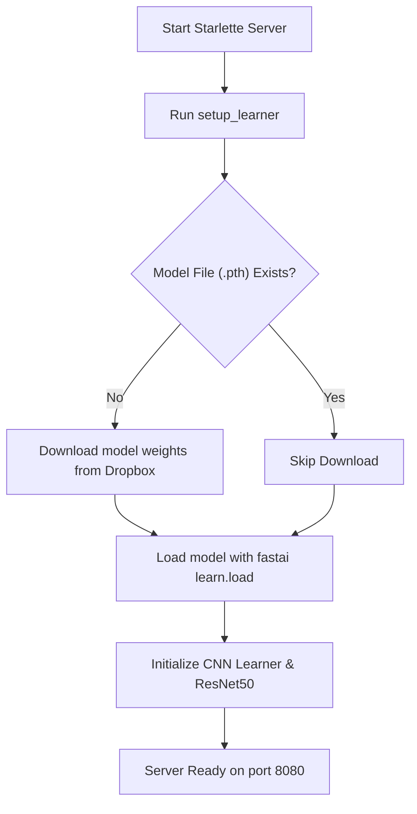
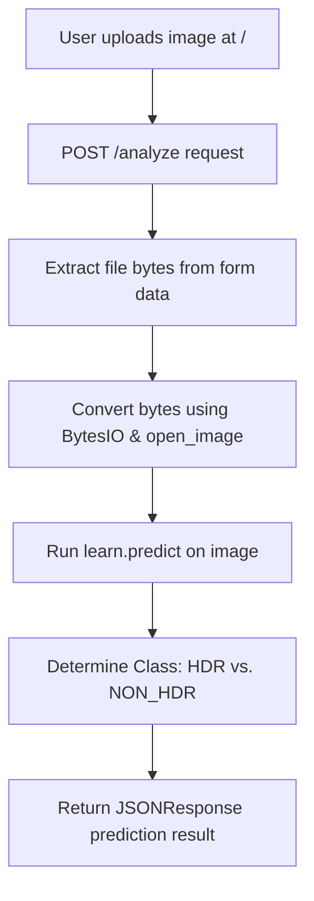

# CV App Test

A Computer Vision web application built with fastai and Starlette that classifies images as HDR vs. NON-HDR. It downloads a pre-trained ResNet50 model automatically on startup and serves predictions via a web interface.

## Project Schema & Structure

```
cv-app-test/
├── app.yaml            # Google App Engine Flexible configuration
├── Dockerfile          # Container build configuration
├── requirements.txt    # Project Python dependencies
└── app/
    ├── server.py       # Main server routing & prediction logic
    ├── models/         # Destination directory for downloaded model file
    ├── static/         # Public static assets (CSS, JS, images)
    └── view/
        └── index.html  # Web interface UI
```

---

## Application Flows

### 1. Startup Flow
On server boot, the application initializes and sets up the fastai learner by verifying and downloading the model weights.



### 2. Prediction Request Flow
When a user uploads an image via the web UI, the Starlette server processes the request asynchronously.



---

## Setup & Running

### Option 1: Running Locally with Python

1. Install system prerequisites (e.g. `gcc`, `python3-dev`).
2. Install dependencies:
   ```bash
   pip install -r requirements.txt
   ```
3. Run the application:
   ```bash
   python app/server.py serve
   ```
4. Access the web interface at `http://localhost:8080`.

### Option 2: Running with Docker

1. Build the Docker container:
   ```bash
   docker build -t cv-app-test .
   ```
2. Run the container:
   ```bash
   docker run -p 8080:8080 cv-app-test
   ```

## Deploying to Google App Engine

Deploy directly to Google App Engine Flexible environment using the Google Cloud SDK:
```bash
gcloud app deploy
```
